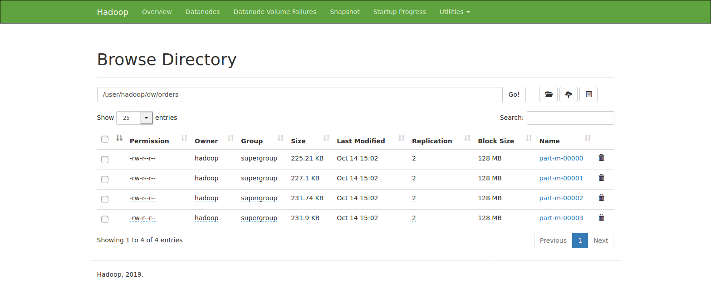
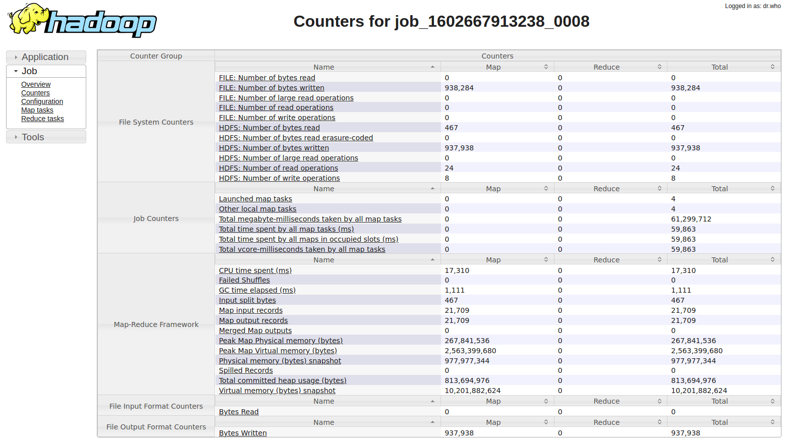
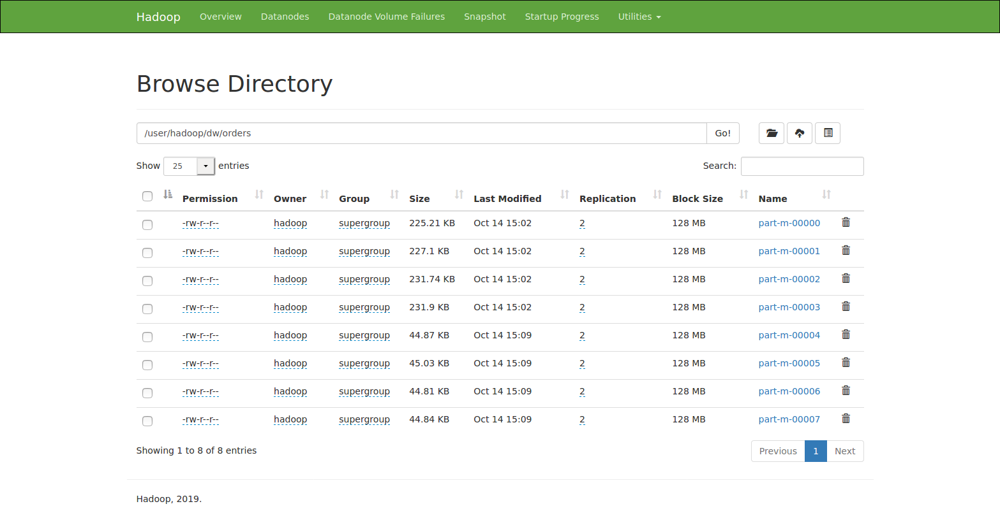
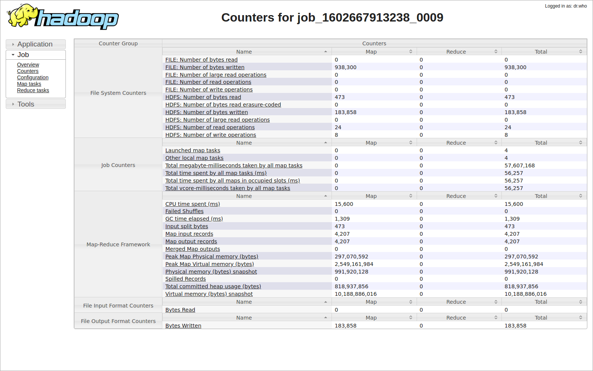

## Use of [Apache Sqoop](https://sqoop.apache.org/), [MySQL](https://www.mysql.com/) and [HDFS](https://hadoop.apache.org/docs/stable/hadoop-project-dist/hadoop-hdfs/HdfsDesign.html) for incremental load from MySQL to HDFS 


### MySQL details

Eshop database with orders table:

```
DROP TABLE IF EXISTS orders;
CREATE TABLE orders (
  order_id int(11) NOT NULL AUTO_INCREMENT,
  order_date datetime NOT NULL,
  order_customer_id int(11) NOT NULL,
  order_status varchar(45) NOT NULL,
  PRIMARY KEY (order_id)
) 
```

```
mysql> select count(*) as row_count from orders;
+-----------+
| row_count |
+-----------+
|     21709 |
+-----------+
1 row in set (0.01 sec)
```


### HDFS

```
Configured Capacity: 2917200629760 (2.65 TB)
Present Capacity: 319772712960 (297.81 GB)
DFS Remaining: 319767908352 (297.81 GB)

-------------------------------------------------
Live datanodes (3)

```


### Apache Sqoop job creation

```
sqoop job --create OrdersJob -- import \
  --connect jdbc:mysql://namenode:3306/eshop \
  --username hadoop \
  --password-file file:///opt/Sqoop/conf/passwords/eshop_MySQL.txt \
  --table orders \
  --check-column order_id \
  --incremental append \
  --last-value 0 \
  --as-textfile \
  --warehouse-dir /user/hadoop/dw
```

Configuration details: ~/.sqoop/metastore.db.script

### Apache Sqoop job execution

```
sqoop job --exec OrdersJob
```

#### Data on HDFS:



From Hadoop JobHistory Server the map input records are 21709:




### New orders in MySQL
```
mysql> select count(*) as row_count from orders;
+-----------+
| row_count |
+-----------+
|     25916 |
+-----------+
1 row in set (0.01 sec)
```


### Apache Sqoop job execution for incremental load

```
sqoop job --exec OrdersJob
```

#### Data on HDFS:



From Hadoop JobHistory Server the map input records are 4207 (new records):




